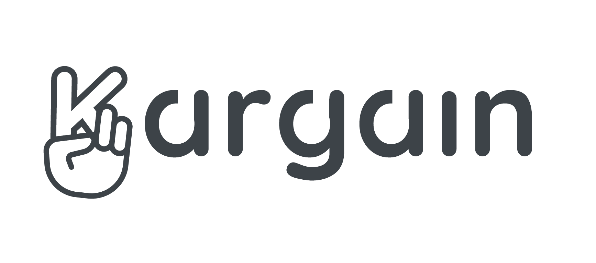

<!-- ALL-CONTRIBUTORS-BADGE:START - Do not remove or modify this section -->
[](#contributors-)
<!-- ALL-CONTRIBUTORS-BADGE:END -->

<h1 align="center" style="margin-top: 1em; margin-bottom: 3em;">
  <p><a href="https://kargain.com"></a></p>
  <p>Welcome to Kargain.com!</p>
</h1>

Web application created with a database that will allow anyone to post and respond to offers to sell vehicles.


## Table of Contents
* [General info](#general-info)
* [Tecnologies](#technologies)
* [Development](#development)
* [Status](#status)
* [Contributors](#contributors)


## General info
Was it for a non-profit organization?
Kargain.com propose a different approach for now.
The subscription to the Kargain platform will be paid for professional actors, and the revenues thus received will be allocated to the maintenance of the project and the developer's remuneration.


## Technologies
* NextJS
* NodeJS
* MongoDB
* check a package.json ...


## Development
How to start working on kargain.com production

1. Fork repo
2. Clone your forks
```
$ git clone https://github.com/*exampleuser/repository.git*
$ cd */repository*
```
3. Install dependencies for the backend *kargain-com/kargain-api* and for the frontend *kargain-com/kargain-app*
```
$ yarn install
```
4. And start product in *kargain-api/*
```
$ yarn start:prod
```
👽 Now Kargain running on your local machine. You can make changes and send us to improve the site.

### Submit an issue
 * Creat a new issue
 * Comment on the issue


## Status
In production 🚀


### 🛰 Search for developers
### 🗂 Tasks:
📌 change logo
📌 decentralized node
📌 integrate blockchain

for more information contact us in the channel 


## Contributors ✨

Thanks goes to these wonderful people ([emoji key](https://allcontributors.org/docs/en/emoji-key)):

<!-- ALL-CONTRIBUTORS-LIST:START - Do not remove or modify this section -->
<!-- prettier-ignore-start -->
<!-- markdownlint-disable -->
<table>
  <tr>
    <td align="center"><a href="https://github.com/daniilgor"><br /><sub><b>daniilgor</b></sub></a><br /><a href="#infra-daniilgor" title="Infrastructure (Hosting, Build-Tools, etc)">🚇</a> <a href="https://github.com/kargainworld/kargain-com/commits?author=daniilgor" title="Tests">⚠️</a> <a href="https://github.com/kargainworld/kargain-com/commits?author=daniilgor" title="Code">💻</a></td>
  </tr>
</table>

<!-- markdownlint-enable -->
<!-- prettier-ignore-end -->
<!-- ALL-CONTRIBUTORS-LIST:END -->

This project follows the [all-contributors](https://github.com/all-contributors/all-contributors) specification. Contributions of any kind welcome!
